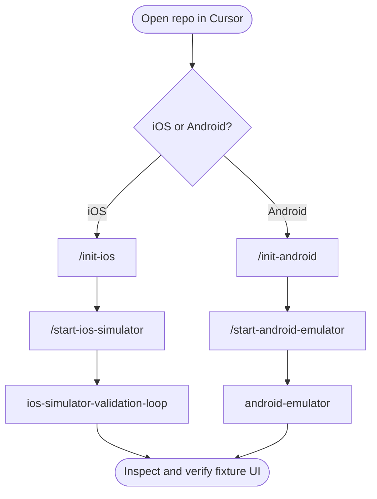

# FlashList Skills Demo

This repo is set up as a demo for Cursor skills around a real React Native codebase. The underlying project is FlashList, but the main thing to try here is the skill-driven workflow in `.cursor/skills`.

Ask Cursor to run one of the skills below when you want to set up the fixture app, start the simulator stack, or validate the running UI.

## Try The Skills

### `/init-ios`

Use `.cursor/skills/init-ios` for first-time iOS setup on macOS. It walks through Node 22.18.0, Yarn Classic, Ruby 3.3, Bundler, `yarn up`, CocoaPods, and installing `agent-device`.

### `/start-ios-simulator`

Use `.cursor/skills/start-ios-simulator` after iOS setup is complete. It starts the three-process dev stack: TypeScript watch, Metro in `fixture/react-native`, and the fixture app in the iOS Simulator.

### `ios-simulator-validation-loop`

Use `.cursor/skills/ios-simulator-validation-loop` once the app is installed or runnable. It runs an observe-act-verify loop: accessibility snapshots, screenshots, optional logs, interaction refs, then proof after each action.

There is also `.cursor/skills/ios-simulator` with the same validation workflow; prefer **`ios-simulator-validation-loop`** in the demo flow below so the skill name matches what you are doing.

### `/init-android`

Use `.cursor/skills/init-android` for first-time Android setup on macOS. It covers Node 22.18.0, Yarn Classic, `ANDROID_HOME`, JDK 17, SDK packages, the `React-Native-Phone` AVD, and `yarn up`.

### `/start-android-emulator`

Use `.cursor/skills/start-android-emulator` after Android setup is complete. It starts the three-process dev stack: TypeScript watch, Metro in `fixture/react-native`, a fresh emulator boot, and `run-android` for the fixture app.

### `android-emulator`

Use `.cursor/skills/android-emulator` once the Android fixture is installed or runnable. It mirrors the iOS validation flow for Android devices and emulators with `agent-device`, screenshots, logs, and `ANDROID_SERIAL` guidance.

## Suggested Demo Flow

Pick iOS or Android, run the setup skills for that platform, then use the matching validation skill once the fixture app is running.



**iOS:** `/init-ios` → `/start-ios-simulator` → `ios-simulator-validation-loop`

**Android:** `/init-android` → `/start-android-emulator` → `android-emulator`

On Android, use `android-emulator` for the same validation pass as on iOS: snapshots, screenshots, taps, and proof that the UI changed.

## Normal Repo Commands

```bash
yarn build
yarn test --forceExit
yarn type-check
yarn lint
```

Run `yarn build` after checking out another branch because the fixture consumes compiled output from `dist/`.

## Background: Original FlashList README


<div align="center">
  <a href="https://shopify.github.io/flash-list/">Website</a> •
  <a href="https://discord.gg/k2gzABTfav">Discord</a> •
  <a href="https://shopify.github.io/flash-list/docs/">Getting started</a> •
  <a href="https://shopify.github.io/flash-list/docs/usage">Usage</a> •
  <a href="https://shopify.github.io/flash-list/docs/fundamentals/performance">Performance</a> •
  <a href="https://shopify.github.io/flash-list/docs/known-issues">Known Issues</a>
<br><br>

**Fast & performant React Native list. No more blank cells.**

Swap from FlatList in seconds. Get instant performance.

</div>

# FlashList v2

FlashList v2 has been rebuilt from the ground up for RN's new architecture and delivers fast performance, higher precision, and better ease of use compared to v1. We've achieved all this while moving to a JS-only solution! One of the key advantages of FlashList v2 is that it doesn't require any estimates. It also introduces several new features compared to v1. To know more about what's new in v2 click [here](https://shopify.github.io/flash-list/docs/v2-changes).

> ⚠️ **IMPORTANT:** FlashList v2.x has been designed to be new architecture only and will not run on old architecture. If you're running on old architecture or using FlashList v1.x, you can access the documentation specific to v1 here: [FlashList v1 Documentation](https://shopify.github.io/flash-list/docs/1.x/).

## Why use FlashList?

### 🚀 Superior Performance

- No more blank cells: FlashList uses view recycling to ensure smooth scrolling without visible blank areas.
- Fast initial render: Optimized for quick first paint.
- Efficient memory usage: Recycles views instead of destroying them, reducing memory overhead.
- Supports view types: Great performance even if different types of components make up the list.
- Dynamic sizes: Super fast and doesn't need any estimates.

### 🎯 Developer Experience

- Drop-in replacement for FlatList: Simply change the component name - if you know FlatList, you already know FlashList.
- No size estimates required in v2: Unlike v1, FlashList v2 automatically handles item sizing.
- Type-safe: Full TypeScript support with comprehensive type definitions.

### 📱 Advanced Features

- Masonry layout support: Create Pinterest-style layouts with varying item heights and column spans.
- Maintain visible content position: Automatically handles content shifts when adding items (enabled by default in v2).
- Multiple recycling pools: Optimizes performance for lists with different item types using `getItemType`.
- Built for React Native's new architecture: FlashList v2 is designed specifically for the new architecture.

### ⚡ Real-world Benefits

- Reduced frame drops: Maintains 60 FPS even with complex item components.
- Lower CPU usage: Efficient recycling reduces computational overhead.
- Smoother scrolling: Predictable performance even with thousands of items.
- JS-only solution in v2: No native dependencies, making it easier to maintain while delivering fast performance.

## Installation

Add the package to your project via `yarn add @shopify/flash-list`.

## Usage

But if you are familiar with [FlatList](https://reactnative.dev/docs/flatlist), you already know how to use `FlashList`. You can try out `FlashList` by changing the component name or refer to the example below:

```jsx
import React from "react";
import { View, Text } from "react-native";
import { FlashList } from "@shopify/flash-list";

const DATA = [
  {
    title: "First Item",
  },
  {
    title: "Second Item",
  },
];

const MyList = () => {
  return (
    <FlashList
      data={DATA}
      renderItem={({ item }) => <Text>{item.title}</Text>}
    />
  );
};
```

To avoid common pitfalls, you can also follow these [`steps`](https://shopify.github.io/flash-list/docs/usage#migration-steps) for migrating from `FlatList`.

## App / Playground

The [fixture](./fixture/) is an example app showing how to use the library.
